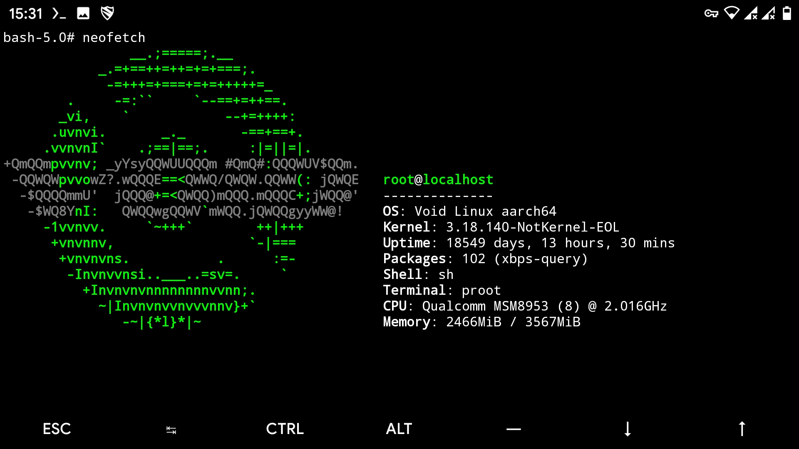

# Void-In-Termux

My continuation of looks like dead original [taichifan's](https://github.com/taichifan/Void-In-Termux) project.

This is a script by which you can install Void nethunter (Void Linux) in your termux application without rooted phone.

Original scripts was modified from Nethunter-In-Termux.

I forked original project and make some changes.

So far working...

exception:

https://github.com/oSoWoSo/Void-In-Termux/issues/8 xbps-src: Packages for void linux can't be builded inside Void-in-Termux

`ERROR unshare (Invalid argument)`

# Two ways of installing void into Termux

### Steps For Installation (official)
`pkg update`

`pkg upgrade`

`pkg install proot-distro`

`proot-distro install void`

After that just type `proot-distro login void` to login

or

### Steps For Installation (taichifan way)
1. Download script in **HOME** `curl -LO https://raw.githubusercontent.com/oSoWoSo/Void-In-Termux/main/TermuxVoid.sh`
2. Give execution permission `chmod +x TermuxVoid.sh`
3. Run script `bash ./TermuxVoid.sh`
4. Now just start Void Linux `startvoid`

### Compulsory Steps For First Time Use (Only for First Time After Installation)(Twice)
1. #xbps-install -Su

#### You have any idea to improve ? So Just give PR

neofetch screenshot:
14. 10. 2020 15:31

